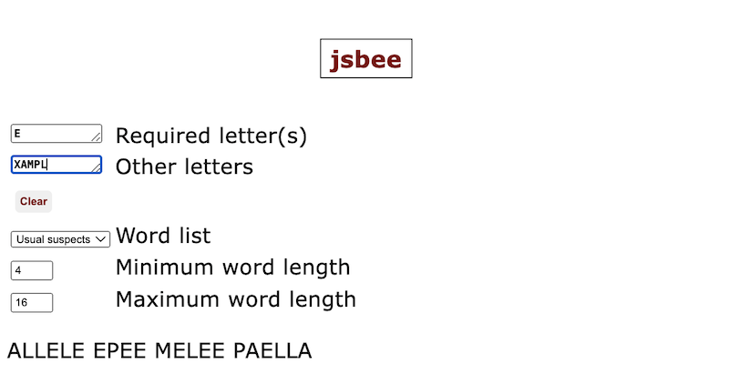
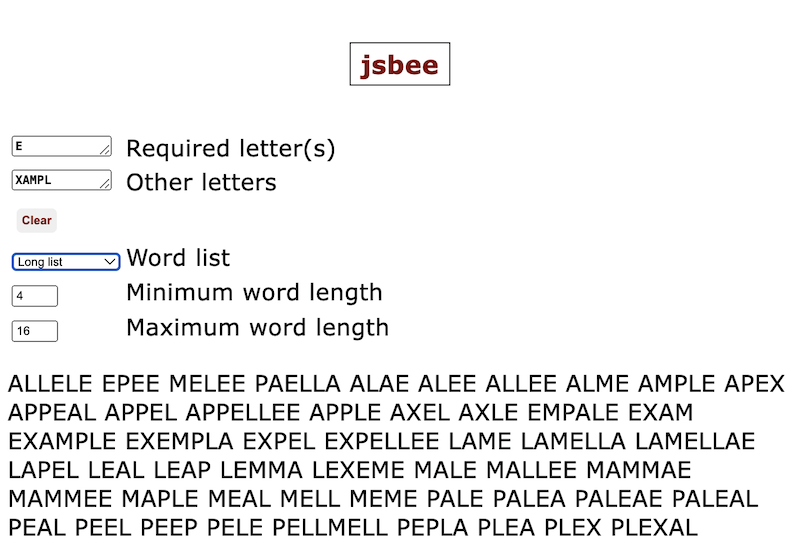
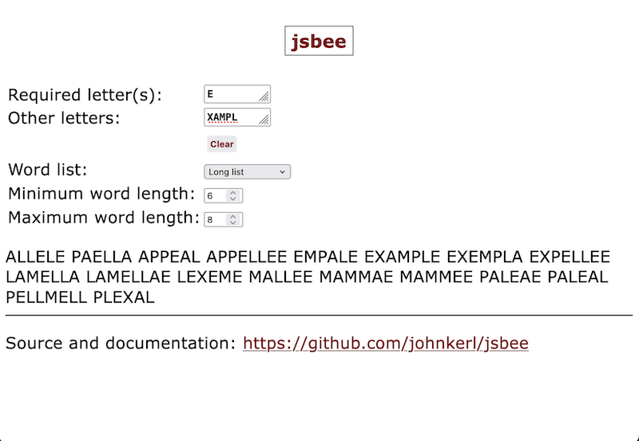
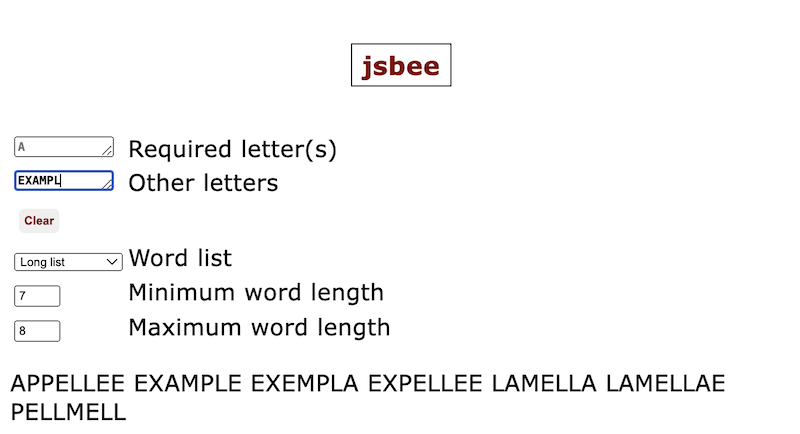

# jsbee

This is a quick little JavaScript app for (last-hope-desperation!!) peeking into anagram and constrained-anagram puzzles including the NYT Spelling Bee.

## Features

* Enter 0 or more required letters. (For the NYT Spelling Bee, there is one center letter.)
* Enter 0 or more other letters. (For the NYT Spelling Bee, there are six other letters.)
* Choose the word list from the dropdown:
  * "Usual suspects" is a short, curated list of once-bitten-twice-shy values from previous Bees.
  * "Long list" is a long list (almost 200K words), not all of which are in the NYT Spelling Bee. That is, this can show words that the NYT Spelling Bee doesn't accept.
* The output shown will include all words from the selected word list which contain only your required letters and your other letters.
* If you enter letters only in the required-letters field, you get more of an anagram-finder.
* If you enter letters only in the other-letters field, you get more of a word-finder.
* If you enter one letter in the required-letters field and six in the others, you get more of a NYT Spelling Bee finder.

## Hosted app

[https://johnkerl.org/jsbee](https://johnkerl.org/jsbee).

Note: this uses the [Sliver JavaScript framework](https://github.com/johnkerl/sliver).

## Examples

Specify one required or "center" letter, and others, using the short list:

Search in the long list:

Constrain the word length:

Make all letters required --- this means any match must include _all_ of the letters:

Make all letters non-required --- this means any match must include _any subset_ of the letters:

