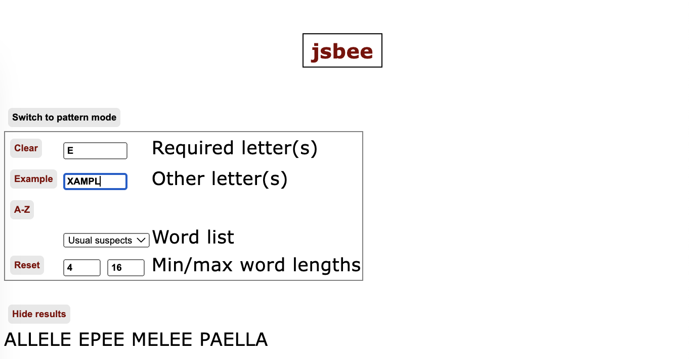
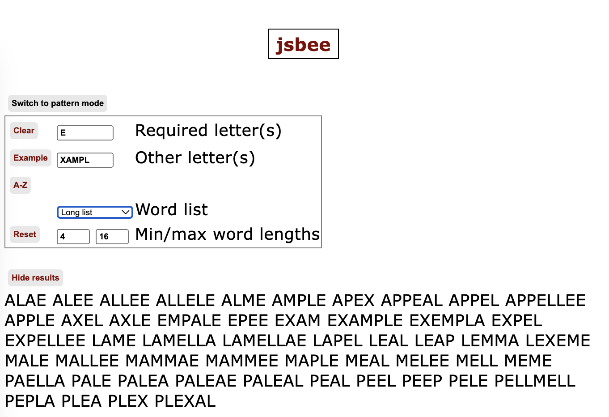
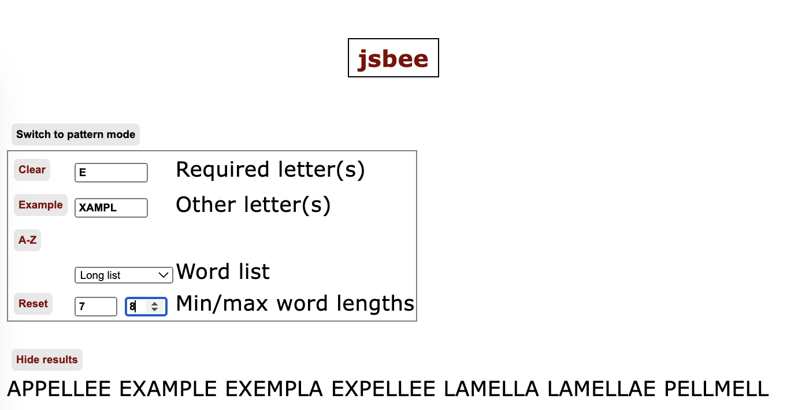
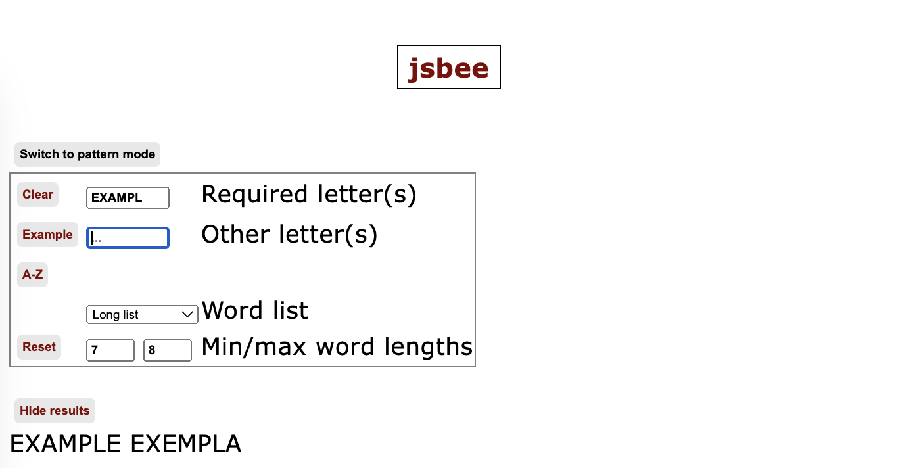
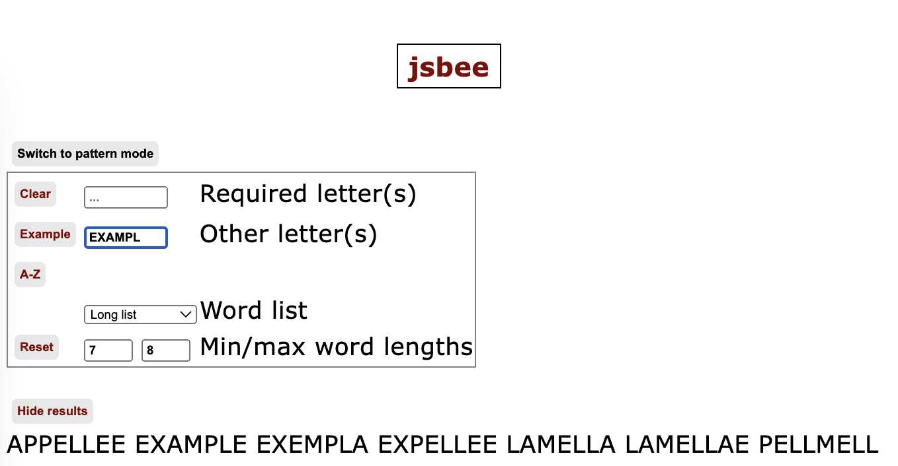
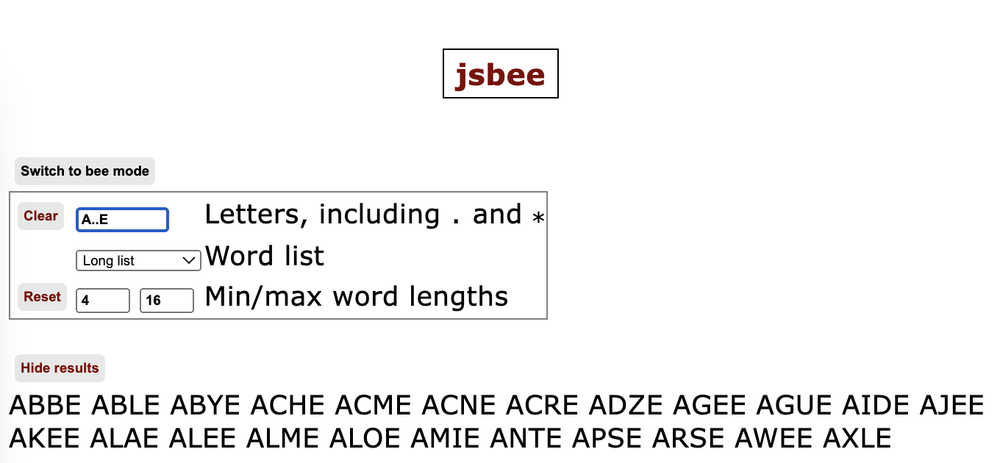
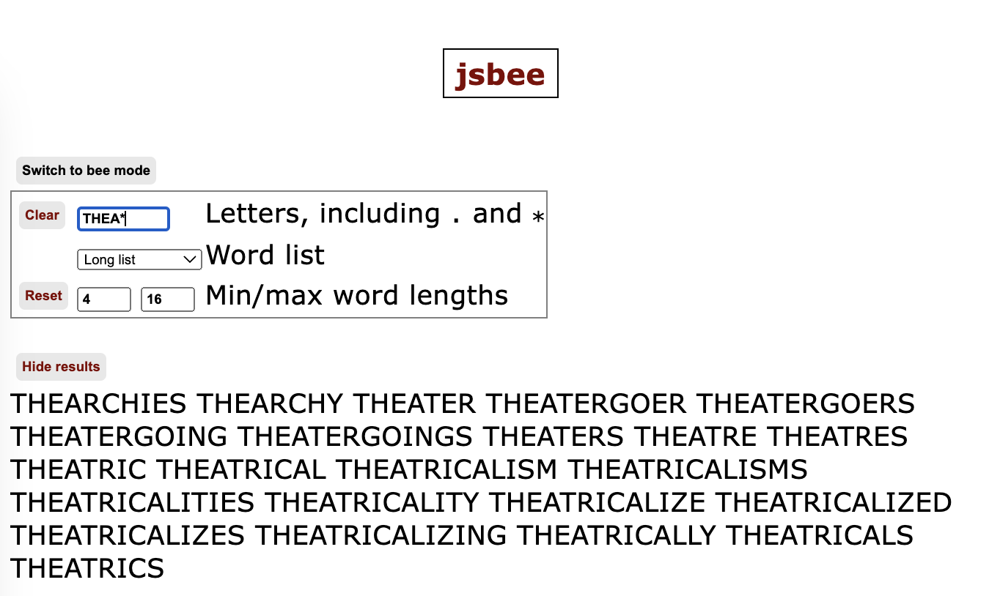

# jsbee

This is a quick little JavaScript app for (last-hope-desperation!!) peeking into anagram and constrained-anagram puzzles including the NYT Spelling Bee.

## Features

Bee mode:

* Enter required and other letters. (For the NYT Spelling Bee, there is one of the former and six of the latter.)
* Choose the word list from the dropdown:
  * "Usual suspects" is a short, curated list of once-bitten-twice-shy values from previous Bees.
  * "Long list" is a long list (almost 200K words), not all of which are in the NYT Spelling Bee. That is, this can show words that the NYT Spelling Bee doesn't accept.
* The output shown will include all words from the selected word list which contain only your required letters and your other letters. If those are `E` and `XAMPLS` then all the words shown will contain only some subset of the letters `EXAMPLS`, and additionally they'll have the letter `E`.
  * If the required letter is `P` and the other letters are `AELM`, then you'll see `PALM` and `PALE` but not `MEAL`.
  * If the required letter is `M` and the other letters are `AELP`, then you'll see `MALL` and `MEAL` but not `PALE`.
* Variations:
  * If you enter letters only in the required-letters field, you get more of an anagram-finder.
  * If you enter letters only in the other-letters field, you get more of a word-finder.

Pattern mode:

* Enter letters, along with `.` or `*`. The `.` will match any letter in one position; `*` will match any number of letters.
* Examples:
  * `A..E` shows `ABLE`, `ACHE`, etc.
  * `*ETH` shows all words ending in `ETH`
  * `THEA*` shows all words starting with `THEA`
  * `TH*ST` shows all words starting with `TH` and ending with `ST`.

## Hosted app

[https://johnkerl.org/jsbee](https://johnkerl.org/jsbee).

## JavaScript tooling

This app uses the [Sliver JavaScript library](https://github.com/johnkerl/sliver).

## Examples

Bee mode: specify one required or "center" letter, and others, using the short list:

Search in the long list:

Constrain the word length:

Make all letters required --- this means any match must include _all_ of the letters:

Make all letters non-required --- this means any match must include _any subset_ of the letters:

Pattern mode:

